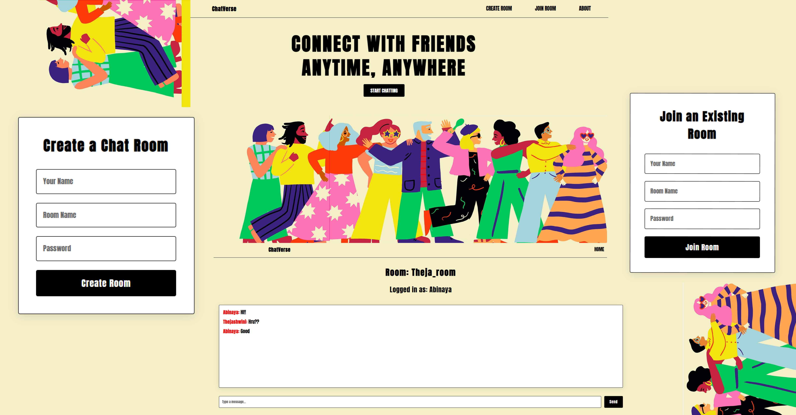
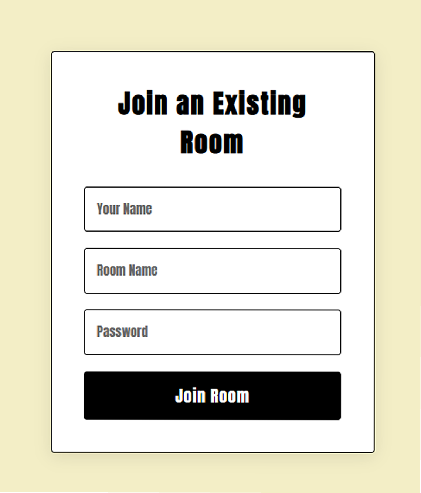
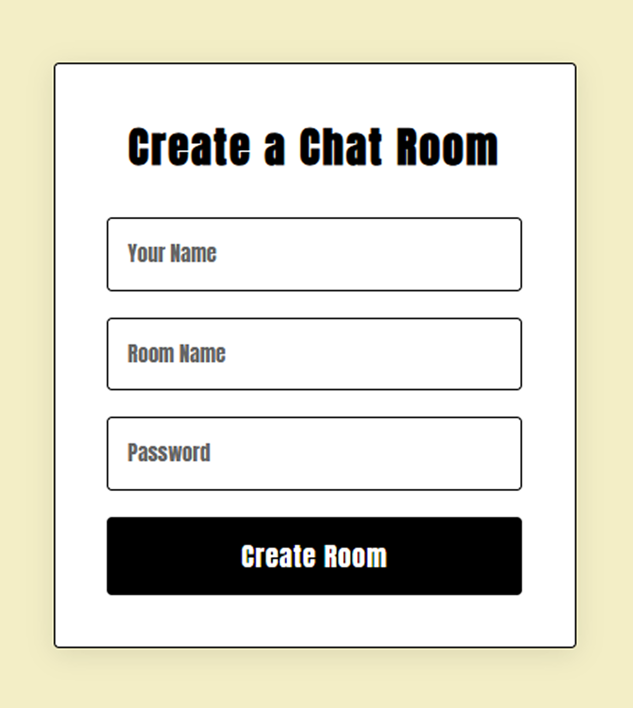
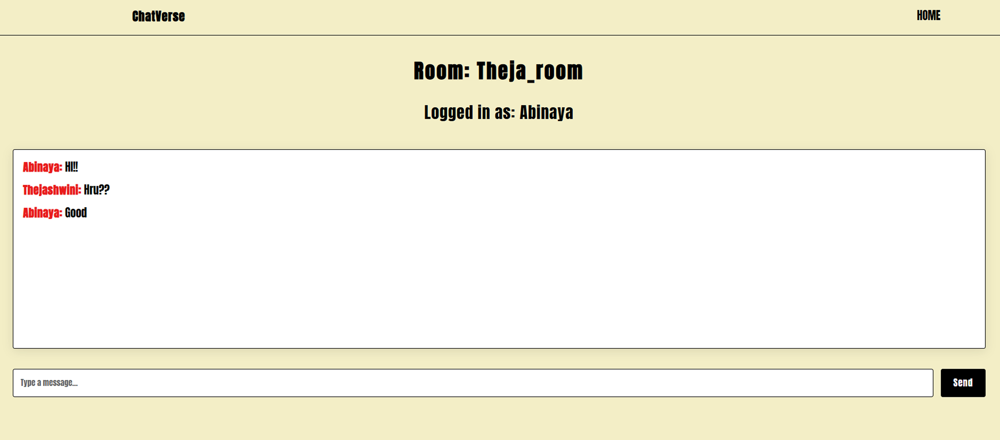

# Real-Time Chat Application

A real-time chat application built using **React (Vite)**, **Node.js**, **Express**, **MongoDB**, and **Socket.IO**.  
Users can create chat rooms, set custom passwords, and chat with friends in real time.

---

## Features

- Create and join chat rooms with a password.
- Real-time messaging using **Socket.IO**.
- Store chat history securely in **MongoDB**.
- Responsive UI that works on both desktop and mobile devices.

---

## Tech Stack

### Frontend
- React (Vite)
- React Router
- TailwindCSS (optional)
- Axios
- Socket.IO Client

### Backend
- Node.js
- Express.js
- MongoDB & Mongoose
- Socket.IO

---

## Screenshots

### Homepage

### Join Room

### Create Room

### Chatroom

---
